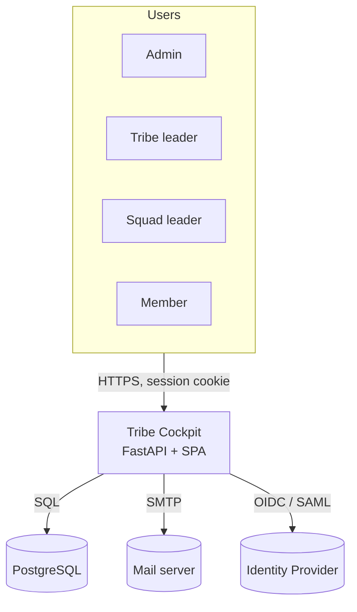
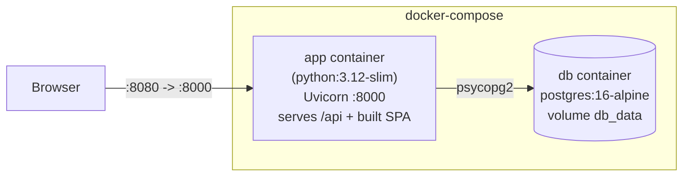
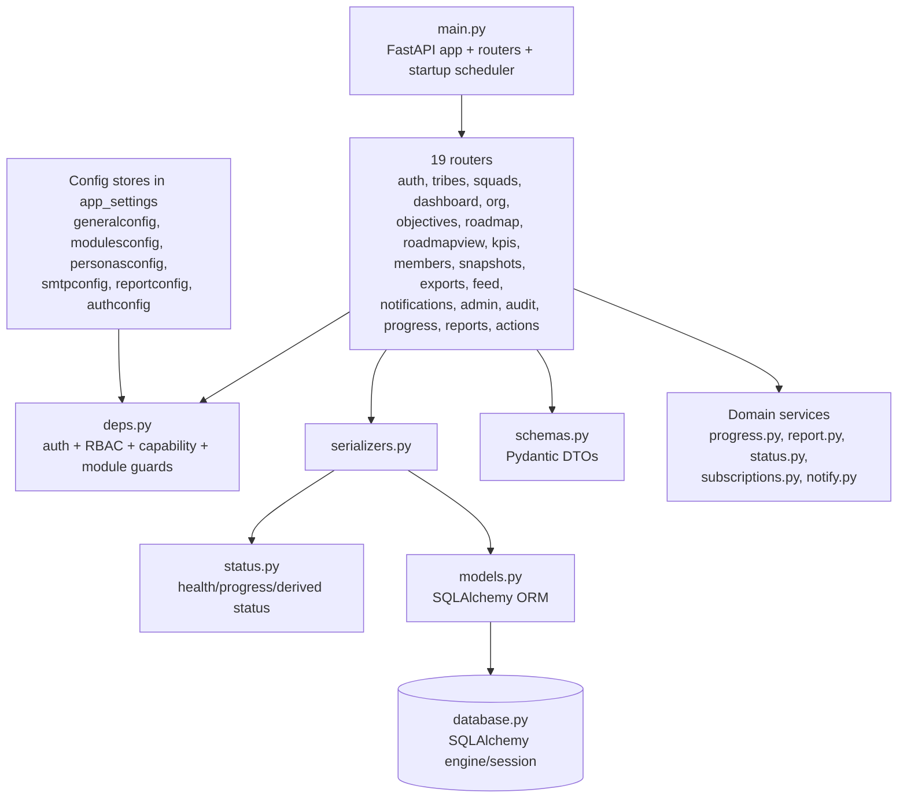
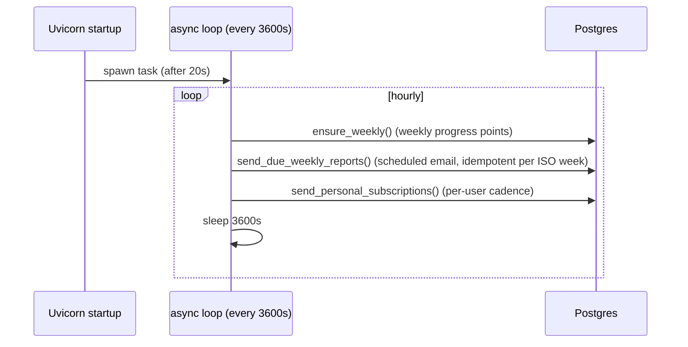
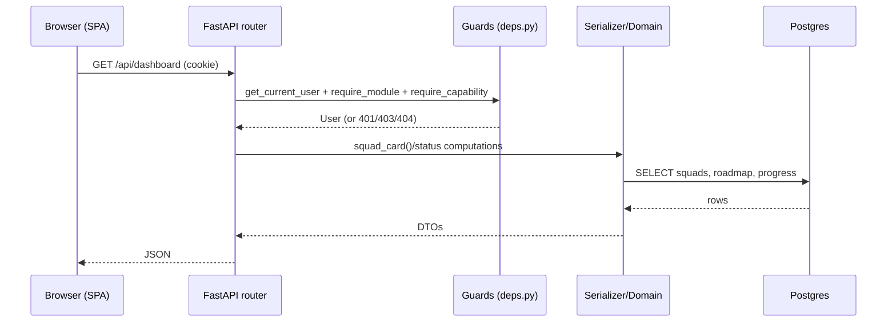

# 02 — Architecture

## Tech stack

| Layer | Technology |
|-------|------------|
| Frontend | React 18, TypeScript 5, React Router 6, Vite 5 (no UI framework; custom CSS design system in `theme.css`) |
| Backend | FastAPI 0.115, Pydantic 2, SQLAlchemy 2, Uvicorn |
| Database | PostgreSQL 16 |
| Migrations | Alembic 1.14 |
| Auth | Starlette SessionMiddleware (itsdangerous), Argon2 (argon2-cffi), Authlib (OIDC), python3-saml (SAML), PyJWT |
| Reporting | python-pptx (PPTX), hand-rendered HTML |
| Packaging | Multi-stage Docker (node build → python runtime serving the SPA) |

## C4 — System context

## C4 — Containers / deployment

- A single **app** image is built in two stages (Dockerfile): stage 1 `npm run build` produces the
  SPA into `frontend/dist`, copied into `app/static`; stage 2 is the Python runtime.
- `docker-entrypoint.sh`: waits for DB → `alembic upgrade head` → `python -m app.init_db` (break-glass
  admin + demo seed) → `uvicorn app.main:app`.
- The API serves the SPA: `/assets` via `StaticFiles`, every other non-`/api` path falls back to
  `index.html` (client-side routing). See [ADR-0001](adr/0001-monolith-serves-spa.md).

## Backend module map

### Layering / separation of concerns
- **Routers** = HTTP boundary (validation via Pydantic schemas, dependency-injected guards).
- **deps.py** = cross-cutting access control: `get_current_user`, `require_admin/_writer/_tribe_or_admin`,
  `require_module(module[,feature])`, `require_capability(cap)`, `assert_can_edit_squad`, etc.
- **serializers.py** = ORM → DTO assembly (and derived values like objective status).
- **status.py / progress.py / report.py** = domain logic (health, progress timeline, rendering).
- **\*config.py** = typed accessors over the `app_settings` JSON key/value store ([ADR-0004](adr/0004-app-settings-json-config.md)).

## Background scheduler

In-process, single-instance scheduler started in `main.py` `@app.on_event("startup")`. It is
**not** distributed — see risks in [10](10-tech-debt-and-risk-register.md) and [ADR-0009](adr/0009-in-process-scheduler.md).

## Request → response sequence (typical authenticated read)

## Frontend architecture

- **SPA** with React Router. `App.tsx` declares routes wrapped by guards: `Protected` (auth/admin),
  `ModuleGuard` and `Section` (module + persona capability).
- **Cross-cutting context**: `auth.tsx` (user, effective role, **capabilities**, impersonation),
  `config.tsx` (public config + modules), `i18n.tsx` (FR/EN, 540 keys, parity-checked).
- **Layout** = sidebar nav (mobile drawer) + topbar (page chrome, ⌘K command palette, notifications).
- **Design system**: `components/ui.tsx` (Modal, EmptyState, Spinner, Dot, StatusBadge, Collapsible…)
  + `theme.css` (CSS variables). See [04 UI in the audit](09-audit-report.md).
- **API client**: `api.ts` thin fetch wrapper (credentials: include, JSON, typed errors).
</content>
