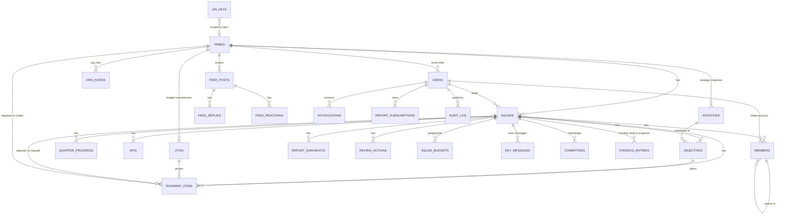

# 03 - Data Model & Dictionary

PostgreSQL, SQLAlchemy 2 ORM (`backend/app/models.py`), migrations in `backend/alembic/versions`.
28 tables. Configuration is **not** in dedicated tables - it lives as JSON blobs in `app_settings`
(see [ADR-0004](adr/0004-app-settings-json-config.md)).

## Entity-Relationship Diagram

## Data dictionary (key columns)

| Table | Key columns | Notes |
|-------|-------------|-------|
| **tribes** | id, name, description, display_order, created_at, **leaves_require_approval**, **leaves_overlap_threshold** | tenant-ish scope unit; last two configure the leave workflow per tribe |
| **users** | id, email (uniq), display_name, **role** (str), **status** (pending/active/disabled), tribe_id→tribes, auth_subject, is_break_glass, password_hash, notify_tweets/replies, email_notifications, subscribe_weekly_report, report_interval_days, report_last_sent_at, last_login_at | `role` = built-in or **custom persona key** (free string); only `active` accounts may log in |
| **squads** | id, tribe_id→tribes, name, description, leader_user_id→users, display_order, **kpis_enabled**, **steerco_enabled**, **budget_enabled**, **squad_type** (product/transverse), **products (JSON)**, **hardware (JSON)** | product squads report via roadmap; transverse via initiatives + OTD; `steerco_enabled` is self-service (the squad leader opts in) |
| **members** | id, squad_id→squads, full_name, role_title, user_id→users, manager_id→members (self), display_order | org chart of a squad |
| **org_nodes** | id, tribe_id→tribes, parent_id→self, title, person_name, squad_id→squads, display_order | editable tribe org chart |
| **initiatives** | id, tribe_id→tribes, year, title, description, squad_id→squads (assigned), owner (free text), deadline, display_order, is_active | strategic initiative set by the tribe leader; read-only below |
| **otds** | id, tribe_id→tribes, year, title, description, **budget_ref**, **committed_date**, owner_user_id→users, display_order | top-management budget delivery commitment; groups jalons (`roadmap_items.otd_id`); on-time status derived |
| **objectives** | id, squad_id→squads, year, title, description, **target_date** (deadline), rag_status (stored default; **derived on read**), weight, is_active, **initiative_id→initiatives** | status computed, not authoritative in column |
| **roadmap_items** | id, squad_id→squads, year, quarter (1-4), title, **theme** (lane), **release_stage** (EA\|GA), description, success_criteria, user_benefit, dependencies (text), **dependency_kind** (text/squad/tribe), dependency_squad_id→squads, dependency_tribe_id→tribes, risks, owner, status (on_track/at_risk/blocked/done), display_order, **objective_id→objectives**, **otd_id→otds** | the "jalon"; chained Initiative→Objective→Jalon |
| **quarter_progress** | id, squad_id→squads, year, quarter, progress_pct, comment · **uniq(squad,year,quarter)** | annual % = mean of 4 quarters |
| **kpis** | id, squad_id→squads, name, unit, target_value, current_value, trend_status (on_target/under_pressure/missed), comment | |
| **report_snapshots** | id, squad_id→squads, submitted_by_user_id→users, submitted_at, **payload (JSON)**, cycle_label | immutable submission snapshots for history/compare |
| **squad_budgets** | id, squad_id→squads, year, **total / spent / forecast** (Numeric), comment, updated_at · **uniq(squad,year)** | opt-in per squad (`budget_enabled`); visible to admin + tribe leader + own squad leader; on-track/overrun derived |
| **key_messages** | id, squad_id→squads, year, **kind** (success/alert/risk), text, display_order, created_at, created_by_user_id→users | curated executive messages under the roadmap |
| **committees** | id, squad_id→squads, name, objective, **frequency** (+frequency_other), day_of_week, time_of_day, duration_minutes, participants, is_active, display_order | recurring governance meetings ("comitologie"); standing, not year-scoped |
| **steerco_entries** | id, squad_id→squads (ON DELETE CASCADE), **period** ("YYYY-MM"), **data (JSON)**, updated_at, updated_by_user_id→users · **uniq(squad,period)** | one monthly steering-committee snapshot (KPI counts, the month's SLA per COTS, incident count, events). Raw values only: variations, SLA colours and the 12-month charts are derived at render time. See [15](15-steerco.md) |
| **report_baselines** | **scope_key (PK)** (global/tribe:id/sub:id), **signature (JSON)**, updated_at | last-emailed report state, diffed to compute "what changed" per recipient |
| **api_keys** | id, name, **prefix** (uniq, public handle), **key_hash** (argon2), **scopes (JSON)**, tribe_id→tribes (NULL = all), created_by_user_id, created_at, expires_at, last_used_at, revoked_at | machine credentials for the read-only API (Admin → API); secret shown once |
| **feed_posts** | id, tribe_id→tribes, author_user_id→users, content, kind (incident/info/success), squad_id→squads, is_pinned, created_at | |
| **feed_replies** | id, post_id→feed_posts, author_user_id→users, content, created_at | |
| **feed_reactions** | id, post_id→feed_posts, user_id→users, kind (like/ack) · **uniq(post,user,kind)** | |
| **notifications** | id, user_id→users, kind (tweet/reply), actor_name, excerpt, link, is_read, created_at | in-app bell |
| **review_actions** | id, squad_id→squads, text, owner, due_date, done, created_by_user_id→users, created_at | COPIL action items |
| **report_subscriptions** | id, user_id→users, squad_id→squads (nullable=dashboard scope), interval_days, last_sent_at · **uniq(user,squad)** | per-user email cadence |
| **leave_types** | id, label, color, display_order, is_active, **requires_detail** | configurable absence categories (admin); `requires_detail` prompts a free-text precision (default "Autre") |
| **leaves** | id, user_id→users, tribe_id→tribes (denormalised at creation), type_id→leave_types, start_date, end_date, **start_half/end_half**, **detail** (public precision), comment (private motif), **status** (pending/approved/rejected/cancelled), created_by_user_id, decided_by_user_id, decided_at, decision_comment | one declared absence; type public, motif private |
| **app_settings** | **key (PK)**, value (Text/JSON) | config store (see below) |
| **audit_log** | id, user_id→users, action, entity, entity_id, timestamp, **detail (JSON)** | append-only audit trail |

## `app_settings` configuration keys

| Key | Owner module | Contents |
|-----|--------------|----------|
| `general` | `generalconfig.py` | app_name, app_subtitle, default_lang, default_year, staleness_threshold_days, feed_post_scope, feed_retention_days, feed_kinds |
| `modules` | `modulesconfig.py` | module on/off + sub-feature flags |
| `personas` | `personasconfig.py` | persona → capability matrix (+ custom personas) |
| `smtp` | `smtpconfig.py` | SMTP host/port/credentials/enabled |
| `weekly_report` | `reportconfig.py` | enabled, recipients, weekday, hour, since_days, last_sent_week |
| `auth_config` | `authconfig.py` | OIDC/SAML runtime toggles |
| `tls` | `tlsconfig.py` | server certificate + key, CA store, self-signed metadata (materialized to `CERT_DIR`) |
| `log_export` | `logexportconfig.py` | audit-log export configuration |
| `change_notify` / `change_notify_state` | `changeconfig.py` | change-notification config + send state |
| `log_level` | `logbuffer.py` | runtime log level set in Admin → Ops with "persist", re-applied at boot (single value, not JSON) |
| `staleness_threshold_days` | `deps.py` | legacy single-value key (also editable in Admin) |

## Data lifecycle notes

- **Snapshots** (`report_snapshots`) are write-once on cycle submission; never mutated → reliable history.
- **Derived, not stored**: `objectives.rag_status` is overridden on read by `status.objective_status()`;
  OTD on-time status and budget on-track/overrun are likewise derived on read.
- **Steerco one-pagers are never persisted**: the document is rebuilt from the last 12
  `steerco_entries` on every render, so the cards, the rolling SLA row and the charts cannot drift
  apart. Anything a client stores by hand in `data` (a trend, an SLA colour) is recomputed and ignored.
- **Cascade deletes**: a squad cascades to its objectives/roadmap/quarter_progress/kpis/members/
  snapshots/budgets/key_messages/committees (ORM `cascade="all, delete-orphan"`). Org nodes & feed posts
  referencing a deleted squad are detached (FK set null), not deleted. `steerco_entries` cascades at
  the **database** level (`ON DELETE CASCADE`), not via an ORM relationship.
- **Leaves**: an absence is visible to everyone in the person's tribe (admins: all) - the *type* and
  *detail* are public, the *comment* (motif) only to the person, their squad/tribe leader and admins.
  Approval is required or not per tribe (`tribes.leaves_require_approval`); a manager filing for self or
  others auto-approves. Day count = calendar days adjusted for half-days (weekends/holidays not excluded).
- **Retention**: feed posts can be auto-pruned by `feed_retention_days` (0 = keep all); audit_log by
  `AUDIT_RETENTION_DAYS` (0 = keep forever).

## Integrity gaps (tracked)

- `users.role` is a free string (custom personas). There is **no FK** to a personas table (personas
  live in `app_settings`), so an orphaned role is possible if config is edited out-of-band; the admin
  PUT reassigns orphans to `member`. See [10](10-tech-debt-and-risk-register.md) TD-DATA-1.
- `objectives.rag_status` column is retained but unauthoritative - potential confusion (TD-DATA-2).
</content>
