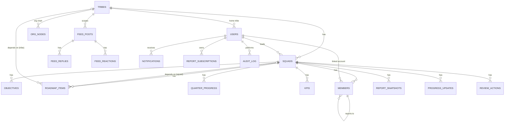

# 03 — Data Model & Dictionary

PostgreSQL, SQLAlchemy 2 ORM (`backend/app/models.py`), migrations in `backend/alembic/versions`.
19 tables. Configuration is **not** in dedicated tables — it lives as JSON blobs in `app_settings`
(see [ADR-0004](adr/0004-app-settings-json-config.md)).

## Entity-Relationship Diagram

## Data dictionary (key columns)

| Table | Key columns | Notes |
|-------|-------------|-------|
| **tribes** | id, name, description, display_order, created_at, **leaves_require_approval**, **leaves_overlap_threshold** | tenant-ish scope unit; last two configure the leave workflow per tribe |
| **users** | id, email (uniq), display_name, **role** (str), tribe_id→tribes, auth_subject, is_break_glass, password_hash, notify_tweets/replies, email_notifications, subscribe_weekly_report, report_interval_days, report_last_sent_at, last_login_at | `role` = built-in or **custom persona key** (free string) |
| **squads** | id, tribe_id→tribes, name, leader_user_id→users, display_order, **kpis_enabled** | |
| **members** | id, squad_id→squads, full_name, role_title, user_id→users, manager_id→members (self), display_order | org chart of a squad |
| **org_nodes** | id, tribe_id→tribes, parent_id→self, title, person_name, squad_id→squads, display_order | editable tribe org chart |
| **objectives** | id, squad_id→squads, year, title, description, **target_date** (deadline), rag_status (stored default; **derived on read**), weight, is_active | status computed, not authoritative in column |
| **roadmap_items** | id, squad_id→squads, year, quarter (1-4), title, **release_stage** (EA\|GA), description, success_criteria, user_benefit, dependencies (text), **dependency_kind** (text/squad/tribe), dependency_squad_id→squads, dependency_tribe_id→tribes, risks, owner, status (on_track/at_risk/blocked/done), display_order | the "jalon" |
| **quarter_progress** | id, squad_id→squads, year, quarter, progress_pct, comment · **uniq(squad,year,quarter)** | annual % = mean of 4 quarters |
| **kpis** | id, squad_id→squads, name, unit, target_value, current_value, trend_status (on_target/under_pressure/missed), comment | |
| **report_snapshots** | id, squad_id→squads, submitted_by_user_id→users, submitted_at, **payload (JSON)**, cycle_label | immutable submission snapshots for history/compare |
| **progress_updates** | id, squad_id→squads, year, created_at, created_by_user_id→users, **kind** (auto/weekly/review), note, confidence (1-5), progress_pct, blocked/at_risk/done/total_count, **state (JSON)**, **changes (JSON)** | the progress-review timeline |
| **feed_posts** | id, tribe_id→tribes, author_user_id→users, content, kind (incident/info/success), squad_id→squads, is_pinned, created_at | |
| **feed_replies** | id, post_id→feed_posts, author_user_id→users, content, created_at | |
| **feed_reactions** | id, post_id→feed_posts, user_id→users, kind (like/ack) · **uniq(post,user,kind)** | |
| **notifications** | id, user_id→users, kind (tweet/reply), actor_name, excerpt, link, is_read, created_at | in-app bell |
| **review_actions** | id, squad_id→squads, text, owner, due_date, done, created_by_user_id→users, created_at | COPIL action items |
| **report_subscriptions** | id, user_id→users, squad_id→squads (nullable=dashboard scope), interval_days, last_sent_at · **uniq(user,squad)** | per-user email cadence |
| **leave_types** | id, label, color, display_order, is_active, **requires_detail** | configurable absence categories (admin); `requires_detail` prompts a free-text precision (default "Autre") |
| **leaves** | id, user_id→users, tribe_id→tribes (denormalised at creation), type_id→leave_types, start_date, end_date, **start_half/end_half**, **detail** (public precision), comment (private motif), **status** (pending/approved/rejected/cancelled), created_by_user_id, decided_by_user_id, decided_at, decision_comment | one declared absence; type public, motif private |
| **app_settings** | **key (PK)**, value (Text/JSON) | config store (see below) |
| **audit_log** | id, user_id→users, action, entity, entity_id, timestamp, **detail (JSON)** | append-only audit trail |

## `app_settings` configuration keys

| Key | Owner module | Contents |
|-----|--------------|----------|
| `general` | `generalconfig.py` | app_name, app_subtitle, default_lang, default_year, staleness_threshold_days, feed_post_scope, feed_retention_days, feed_kinds |
| `modules` | `modulesconfig.py` | module on/off + sub-feature flags |
| `personas` | `personasconfig.py` | persona → capability matrix (+ custom personas) |
| `smtp` | `smtpconfig.py` | SMTP host/port/credentials/enabled |
| `weekly_report` | `reportconfig.py` | enabled, recipients, weekday, hour, since_days, last_sent_week |
| `auth_config` | `authconfig.py` | OIDC/SAML runtime toggles |

## Data lifecycle notes

- **Snapshots** (`report_snapshots`) are write-once on cycle submission; never mutated → reliable history.
- **Progress updates** are append-mostly; rapid `auto` edits by the same user within 30 min are
  **coalesced** into the latest point (`progress.py:COALESCE_MINUTES`).
- **Derived, not stored**: `objectives.rag_status` is overridden on read by `status.objective_status()`.
- **Cascade deletes**: a squad cascades to its objectives/roadmap/quarter_progress/kpis/members/
  snapshots/progress_updates (ORM `cascade="all, delete-orphan"`). Org nodes & feed posts referencing a
  deleted squad are detached (FK set null), not deleted.
- **Leaves**: an absence is visible to everyone in the person's tribe (admins: all) — the *type* and
  *detail* are public, the *comment* (motif) only to the person, their squad/tribe leader and admins.
  Approval is required or not per tribe (`tribes.leaves_require_approval`); a manager filing for self or
  others auto-approves. Day count = calendar days adjusted for half-days (weekends/holidays not excluded).
- **Retention**: feed posts can be auto-pruned by `feed_retention_days` (0 = keep all). No retention on
  audit_log / progress_updates (see tech-debt register).

## Integrity gaps (tracked)

- `users.role` is a free string (custom personas). There is **no FK** to a personas table (personas
  live in `app_settings`), so an orphaned role is possible if config is edited out-of-band; the admin
  PUT reassigns orphans to `member`. See [10](10-tech-debt-and-risk-register.md) TD-DATA-1.
- `objectives.rag_status` column is retained but unauthoritative — potential confusion (TD-DATA-2).
</content>
