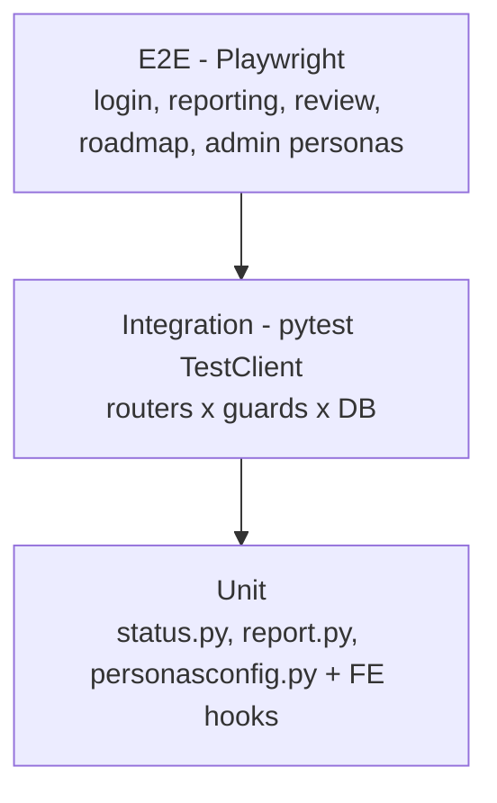

# 08 - Testing Strategy

## Current state

| Layer | Tooling | Coverage |
|-------|---------|----------|
| Backend unit/integration | pytest + FastAPI `TestClient` + SQLite in-memory | **Good** - 131 tests / 13 modules |
| Frontend unit/component | **Vitest + Testing Library + jsdom** | **Present** - 11 tests (labels, perms, i18n parity), wired into CI |
| End-to-end | `e2e_test.py` (script at repo root) | **Ad-hoc**, not in CI - Playwright still to add |
| Type safety | `tsc --noEmit` (FE), Pydantic (BE) | Enforced |
| i18n parity | custom script | Enforced (FR/EN 540/540) |

### Backend test modules
`test_status`, `test_freshness`, `test_modules`, `test_rbac`, `test_rbac_admin`, `test_personas`,
`test_review_access`, `test_report`, `test_roadmap_deps`, `test_snapshot`, `test_actions`,
`test_notifications`. They cover RBAC/persona capabilities, derived objective status, roadmap
dependency + EA/GA, report/roadmap rendering (incl. single-page guarantee), snapshots, freshness.

## Gaps (prioritized)

| Gap | Priority |
|-----|----------|
| No frontend component tests (Vitest + React Testing Library) | P1 |
| No real E2E (Playwright) for the core journeys | P1 |
| No coverage reporting / threshold gate | P2 |
| No load/performance test (dashboard & report at scale) | P2 |
| No contract test of OpenAPI (breaking-change detection) | P2 |
| No security test (auth bypass fuzz, RBAC matrix property test) | P2 |

## Target test pyramid

## Recommended additions (quick wins)

1. **Vitest** in `frontend` (`npm i -D vitest @testing-library/react jsdom`) - start with `i18n` parity
   as a test, `Section`/capability guard logic, `ExportMenu` URL building, `RoadmapPage` rendering.
2. **Playwright** smoke for the 5 core journeys (see [01](01-product-overview.md) personas).
3. **CI gate** (added in `.github/workflows/ci.yml`): backend pytest + FE typecheck + FE build +
   i18n parity. Extend with coverage once Vitest lands.
4. **`pip-audit` / `npm audit`** in CI for dependency CVEs.
</content>
