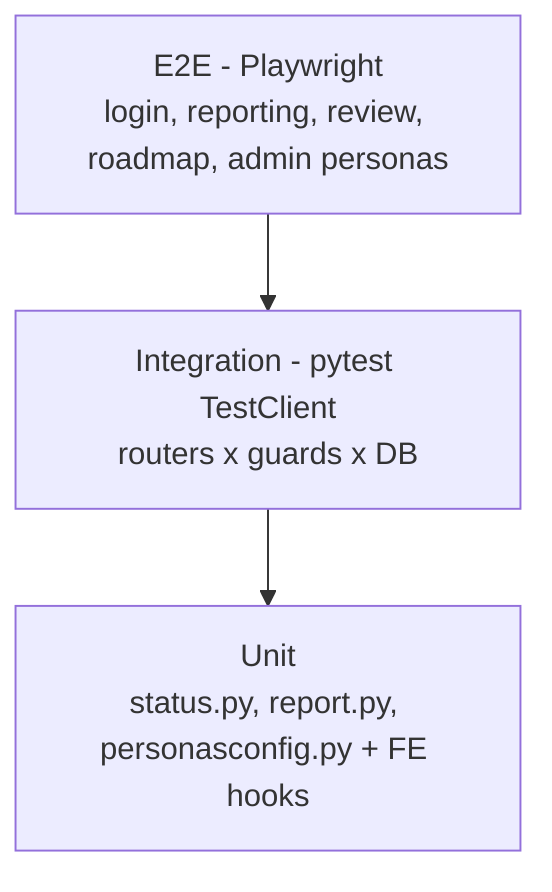

# 08 - Testing Strategy

## Current state

| Layer | Tooling | Coverage |
|-------|---------|----------|
| Backend unit/integration | pytest + FastAPI `TestClient` + SQLite in-memory | **Good** - 289 tests / 32 modules |
| Frontend unit/component | **Vitest + Testing Library + jsdom** | **Present** - 11 tests (labels, perms, i18n parity), wired into CI |
| End-to-end (functional) | `e2e_test.py` (script at repo root) | **Ad-hoc**, not in CI - Playwright still to add |
| End-to-end (deployment + SSO) | [Kubernetes + Keycloak bench](16-banc-kubernetes-sso.md), `bench/k8s-sso/run-tests.py` | **Manual**, reproducible - 18 checks against a real IdP (OIDC and SAML) |
| Coverage | `pytest-cov`, floor in `backend/.coveragerc` | Enforced in CI - **74%** on `app/` (entry points and seed scripts excluded) |
| Type safety | `tsc --noEmit` (FE), Pydantic (BE) | Enforced |
| i18n parity | Vitest (`i18n.parity.test.ts`) | Enforced (FR/EN 1132/1132) |

### Backend test modules
`test_access`, `test_access_history`, `test_actions`, `test_api_keys`, `test_authconfig_urls`, `test_budget`, `test_changenotify`, `test_committees`, `test_freshness`, `test_hardening`, `test_initiatives_otd`, `test_leaves`, `test_logconfig`, `test_logexport`, `test_modules`, `test_notifications`, `test_ops`, `test_otds`, `test_personas`, `test_pptx_template`, `test_rbac`, `test_rbac_admin`, `test_report`, `test_review_access`, `test_roadmap_deps`, `test_saml_settings`, `test_snapshot`, `test_squad_products`, `test_ssotest`, `test_status`, `test_steerco`, `test_tls`.

They cover RBAC/persona capabilities, derived objective status, roadmap dependency + EA/GA,
report/roadmap rendering (incl. the single-page guarantee), snapshots, freshness, the SSO URL
derivation and SAML settings assembly, TLS material handling, log export and the Steerco module.

## Gaps (prioritized)

| Gap | Priority |
|-----|----------|
| No real E2E (Playwright) for the core journeys | P1 |
| No load/performance test (dashboard & report at scale) | P2 |
| No contract test of OpenAPI (breaking-change detection) | P2 |
| No security test (auth bypass fuzz, RBAC matrix property test) | P2 |

## Coverage

```bash
cd backend
python -m pytest --cov=app --cov-report=term-missing     # the report, with the missing lines
python -m pytest --cov=app --cov-report=html && open htmlcov/index.html
```

Coverage is **not** in `addopts`: measuring costs about a third of the run time and
the number only matters in CI, so a local `pytest` stays fast.

The floor (`fail_under` in `backend/.coveragerc`) is a **ratchet**, set just under
what the suite actually reaches. Raise it when coverage improves; never lower it to
make a build pass, because a change that drops coverage is a change that needs
tests. Entry points and one-shot data loaders (`server.py`, `init_db.py`,
`bootstrap.py`, `seed*.py`, `reset_data.py`) are excluded: they are exercised by
running the app, and counting them would let real gaps hide behind a comfortable
percentage.

The largest genuine hole today is **`app/import_org.py`** (188 statements, 0%),
which parses an administrator-supplied Excel file. It is worth tests.

There is no frontend coverage gate. With eleven unit tests the floor would sit at a
number so low it would protect nothing; the real gap on that side is end-to-end
coverage, tracked separately.

## Target test pyramid


```mermaid
flowchart TB
  E2E[E2E - Playwright\nlogin, reporting, review, roadmap, admin personas] --> INT
  INT[Integration - pytest TestClient\nrouters x guards x DB] --> UNIT
  UNIT[Unit\nstatus.py, report.py, personasconfig.py + FE hooks]
```

## Recommended additions (quick wins)

1. **Vitest** in `frontend` (`npm i -D vitest @testing-library/react jsdom`) - start with `i18n` parity
   as a test, `Section`/capability guard logic, `ExportMenu` URL building, `RoadmapPage` rendering.
2. **Playwright** smoke for the 5 core journeys (see [01](01-product-overview.md) personas).
3. **CI gate** (added in `.github/workflows/ci.yml`): backend pytest + FE typecheck + FE build +
   i18n parity. Extend with coverage once Vitest lands.
4. **`pip-audit` / `npm audit`** in CI for dependency CVEs.
</content>
