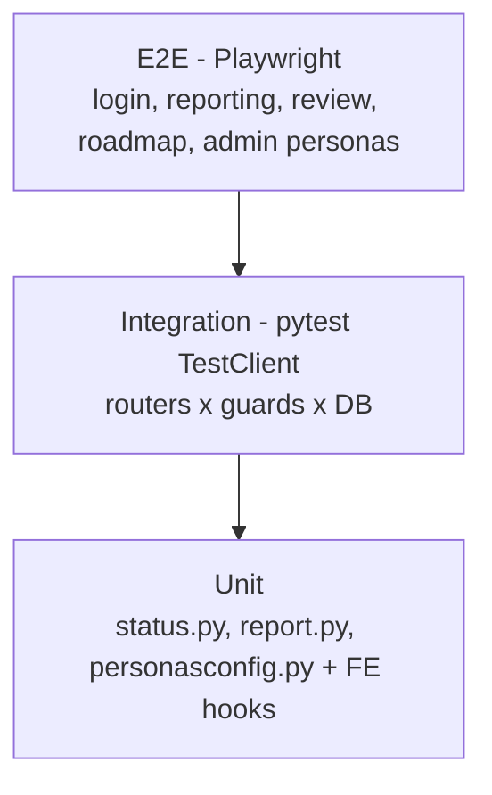

# 08 - Testing Strategy

## Current state

| Layer | Tooling | Coverage |
|-------|---------|----------|
| Backend unit/integration | pytest + FastAPI `TestClient` + SQLite in-memory | **Good** - 378 tests / 39 modules |
| Frontend unit/component | **Vitest + Testing Library + jsdom** | **Present** - 23 tests (labels, perms, i18n parity and usage, typography, the language a visitor gets, the HTTPS panel), wired into CI |
| End-to-end (browser) | **Playwright** against the real Docker stack ([18](18-tests-e2e.md)) | **34 tests in CI** - login, route guards, RBAC, the write path, the audit screen, every one of the 18 admin sections, the trusted-authority panel in infra-TLS mode, and the language a first-time visitor gets |
| End-to-end (API script) | `e2e_test.py` (script at repo root) | Ad-hoc, not in CI - superseded for the journeys Playwright now covers |
| End-to-end (deployment + SSO) | [Kubernetes + Keycloak bench](16-banc-kubernetes-sso.md), `bench/k8s-sso/run-tests.py` | **Manual**, reproducible - 18 checks against a real IdP (OIDC and SAML) |
| Coverage | `pytest-cov`, floor in `backend/.coveragerc` | Enforced in CI - **80%** on `app/`, ratchet at 79 (entry points and seed scripts excluded) |
| Type safety | `tsc --noEmit` (FE), Pydantic (BE) | Enforced |
| i18n parity | Vitest (`i18n.parity.test.ts`) | Enforced (FR/EN 1023/1023) |
| i18n usage | Vitest (`i18n.usage.test.ts`) | Enforced both ways - no key the code asks for is missing (it would render as the raw key), no key in the dictionary is unreachable |
| Typography | `test_typography.py` (whole repository), `typography.test.ts` (frontend), `test_report_typography.py` (rendered HTML/PPTX) | Enforced - no em dash, no middot anywhere, no allowlist |

### Backend test modules
`test_access`, `test_access_history`, `test_actions`, `test_api_keys`, `test_audit_api`, `test_authconfig_urls`, `test_budget`, `test_changenotify`, `test_committees`, `test_freshness`, `test_hardening`, `test_import_org`, `test_initiatives_otd`, `test_insecure_defaults`, `test_leaves`, `test_logconfig`, `test_logexport`, `test_metrics`, `test_modules`, `test_notifications`, `test_oidc_client`, `test_ops`, `test_otds`, `test_personas`, `test_pptx_template`, `test_rbac`, `test_rbac_admin`, `test_report`, `test_report_surface`, `test_retention`, `test_review_access`, `test_roadmap_deps`, `test_saml_settings`, `test_snapshot`, `test_squad_products`, `test_ssotest`, `test_status`, `test_steerco`,
`test_trust`, `test_trust_store`, `test_typography`, `test_report_typography`.

They cover RBAC/persona capabilities, derived objective status, roadmap dependency + EA/GA,
report/roadmap rendering (incl. the single-page guarantee), snapshots, freshness, the SSO URL
derivation and SAML settings assembly, TLS material handling, log export and the Steerco module.

## Gaps (prioritized)

| Gap | Priority |
|-----|----------|
| No load/performance test (dashboard & report at scale) | P2 |
| No contract test of OpenAPI (breaking-change detection) | P2 |
| No security test (auth bypass fuzz, RBAC matrix property test) | P2 |

## Coverage

```bash
cd backend
python -m pytest --cov=app --cov-report=term-missing     # the report, with the missing lines
python -m pytest --cov=app --cov-report=html && open htmlcov/index.html
```

Coverage is **not** in `addopts`: measuring costs about a third of the run time and
the number only matters in CI, so a local `pytest` stays fast.

**The test database enforces foreign keys**, since a `PRAGMA foreign_keys=ON` listener
was added to the SQLite engine in `conftest`. SQLite ignores them otherwise, and the
silence was expensive: `DELETE /api/admin/users/{id}` returned 500 in production for
any account that had ever logged in, because nineteen columns reference `users` with
`NO ACTION` and nothing detached them, while 402 tests passed over it. Turning
enforcement on broke nothing else, which is the useful part of the answer.

The floor (`fail_under` in `backend/.coveragerc`) is a **ratchet**, set just under
what the suite actually reaches. Raise it when coverage improves; never lower it to
make a build pass, because a change that drops coverage is a change that needs
tests. Entry points and one-shot data loaders (`server.py`, `init_db.py`,
`bootstrap.py`, `seed*.py`, `reset_data.py`) are excluded: they are exercised by
running the app, and counting them would let real gaps hide behind a comfortable
percentage.

`app/import_org.py` was the largest hole (188 statements, 0%) and is now at 83%. Writing
those tests found a real bug: see the note on the `Tribu` sheet in
[14](14-import-organisation.md). That is the argument for the whole exercise.

The second-largest hole was hiding behind a comfortable number. `reportpptx.py` sat at 64.7%
because the shared fixtures give a squad a name and a leader and nothing else: no budget, no
deadlines, no dependencies, no key messages, and no viewer (the budget is withheld without
one). So the richest half of the flagship deliverable, including the entire 130-line
single-squad slide builder, rendered in no test at all. `test_report_typography.py` fills one
squad with every optional field and reads all eight rendered documents; that module is now at
95.9%. A percentage on a module that builds documents means little until something actually
reads the documents.

There is no frontend coverage gate. With twenty-three unit tests the floor would sit at
a number so low it would protect nothing; the real gap on that side is end-to-end
coverage, tracked separately.

Two of those twenty are component tests (jsdom + Testing Library), the first in the
repo: `i18n.lang.test.tsx` and `pages/admin/authentication.test.tsx`. Both exist
because a rendered-behaviour bug is invisible to a typecheck and expensive to catch
in Playwright: the instance default language never reaching the screen, and a panel
hidden behind the wrong condition. That is the shape worth reaching for this tool
for, rather than re-testing what `tsc` already proves.

## Target test pyramid


```mermaid
flowchart TB
  E2E[E2E - Playwright\nlogin, reporting, review, roadmap, admin personas] --> INT
  INT[Integration - pytest TestClient\nrouters x guards x DB] --> UNIT
  UNIT[Unit\nstatus.py, report.py, personasconfig.py + FE hooks]
```

## Recommended additions (quick wins)

1. **Vitest** in `frontend` (`npm i -D vitest @testing-library/react jsdom`) - start with `i18n` parity
   as a test, `Section`/capability guard logic, `ExportMenu` URL building, `RoadmapPage` rendering.
2. **Playwright** smoke for the 5 core journeys (see [01](01-product-overview.md) personas).
3. **CI gate** (in `.github/workflows/ci.yml`): backend pytest with the coverage ratchet and the
   OpenAPI snapshot check, FE typecheck + Vitest + build, Playwright e2e on the real Docker
   stack, the image build, and a non-blocking dependency audit. The i18n parity rule lives in
   Vitest only, in one place.
4. **`pip-audit` / `npm audit`** in CI for dependency CVEs.
</content>
