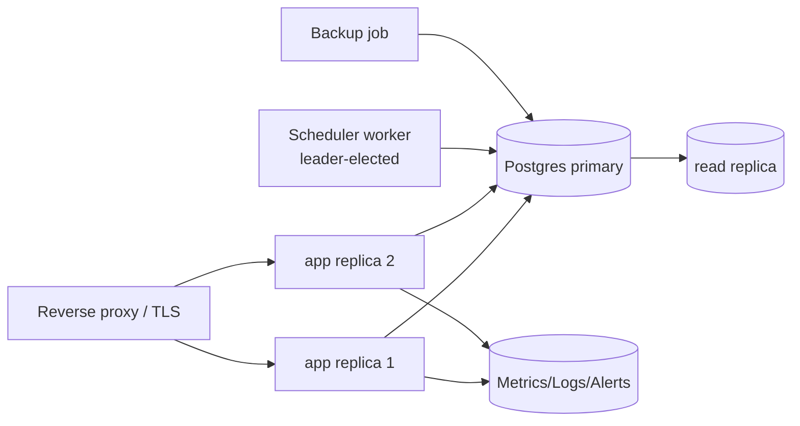

# 11 - Roadmap & Enterprise Readiness

## Enterprise readiness assessment

| Dimension | Maturity | Notes |
|-----------|----------|-------|
| Product completeness | 🟢 High | Coherent, covers the tribe-steering job end to end |
| UX/UI | 🟢 High | Modern, responsive, accessible (AA-leaning), i18n FR/EN |
| Code quality | 🟢 High | Layered, typed, tested (backend), low dead code |
| Architecture | 🟡 Medium | Clean monolith; single-replica assumptions; no HA |
| Security | 🟢 High | RBAC + **env-driven cookie hardening + login throttle + default-secret guard** |
| Testing | 🟡 Medium | Strong backend (131) + **frontend Vitest (11)**; E2E still to add |
| DevOps/CI-CD | 🟢 High | Reproducible build + **CI (tests/typecheck/build/i18n/audit)** + Dependabot; no CD/envs yet |
| Observability | 🔴 Low | Logs + audit only; no metrics/alerting |
| Data/BCP | 🟡 Medium | **Backup sidecar (pg_dump + rotation)**; DR drills/PITR still to formalize |
| Compliance/Governance | 🟡 Medium | Audit log + access control; no formal retention/DPA |
| Multi-tenancy/SaaS | 🔴 Low | Tribe scoping only; not isolated for external tenants |
| FinOps | 🔴 Low | Single small footprint; no cost controls/metrics |

**Verdict:** ready for **internal production** after the P0 hardening (secrets/TLS + backups);
needs the P1 track before scale or external/SaaS use.

## Roadmap

### Quick wins (days)
- [x] CI pipeline (backend tests + FE typecheck/test/build + i18n parity + image build) - `.github/workflows/ci.yml`
- [x] `.env.example` documenting all config/secrets
- [x] Startup guard: loud warning when default `SECRET_KEY`/Postgres password are in use (`main.py`)
- [x] `https_only` / `SameSite` session cookie now **env-driven** (`COOKIE_SECURE`, `COOKIE_SAMESITE`)
- [x] Scheduled `pg_dump` backup sidecar with rotation (`docker compose --profile backup up -d`)
- [x] `pip-audit` + `npm audit` (non-blocking CI job) + Dependabot (`.github/dependabot.yml`)
- [x] Commit `openapi.json` snapshot (diff job is a follow-up)

### High impact (weeks)
- [ ] Observability: structured logs + Prometheus/OTel metrics + alerting + uptime probe
- [x] Login rate-limiting (per-IP throttle, env-configurable) - `auth.py`
- [x] Frontend tests (Vitest, 11 tests) wired into CI; **E2E (Playwright)** still to add
- [x] Externalize the scheduler via **Postgres advisory lock** (multi-replica safe) - `main.py`
- [x] Performance: **eager-loading** on dashboard/report (N+1 removed) + **route code-splitting**
      (initial bundle 384→246 KB); audit-log pagination still open
- [x] Data retention: opt-in purge of old audit/auto-progress records (`maintenance.py`)

### Strategic investments (quarter)
- [ ] Environment promotion (dev → staging → prod) + CD with migrations gating
- [ ] Backups → full DR runbook (RPO/RTO targets) + restore drills
- [ ] Design tokens + component-library extraction; split large components
- [ ] Data retention/archival policy (audit_log, report_snapshots) + GDPR/DPA posture

### Long-term evolution
- [ ] True multi-tenancy / SaaS (per-tenant isolation, billing, FinOps dashboards)
- [ ] External integrations (Jira/Azure DevOps roadmap & status sync)
- [ ] Real-time collaboration (websockets) on reporting/feed
- [ ] Analytics & trends (objective/roadmap velocity, predictive risk)

## Architecture roadmap (target for scale)

</content>
