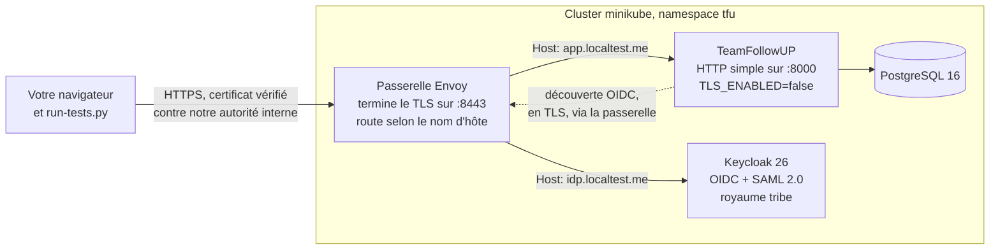

# 16 - Banc Kubernetes de bout en bout, avec Keycloak en OIDC et SAML

Ce document vous fait monter, sur votre machine, un déploiement complet de
TeamFollowUP tel qu'il tourne en production : l'application dans un cluster
Kubernetes, derrière une passerelle qui termine le TLS, avec un vrai fournisseur
d'identité, puis il valide les deux protocoles de connexion (OIDC et SAML 2.0).

Il est écrit pour être suivi sans rien deviner. Chaque outil est installé ici,
chaque commande est expliquée, chaque script fourni est décrit avant d'être lancé,
et chaque étape dit ce que vous devez voir à l'écran pour savoir qu'elle a marché.

Validé sur minikube (pilote Docker), Kubernetes v1.34, Keycloak 26.0, Envoy 1.31 :
**18 vérifications sur 18**.

**Durée** : environ 45 minutes la première fois, dont 20 de téléchargement d'images.
Une fois les outils installés, rejouer le banc prend 10 minutes.

**Ce que ça ne casse pas** : rien n'est écrit dans votre fichier `hosts`, rien n'est
ajouté au magasin de certificats de votre poste, et tout se supprime avec deux
commandes à la fin.

---

## 1. Ce qu'on construit, et pourquoi

### Le problème que ce banc résout

En production, l'application ne parle jamais TLS elle-même. Elle sert du HTTP
simple sur un port unique, et c'est l'infrastructure (un load balancer, une
passerelle) qui termine le TLS devant elle. Ce détour change tout pour le SSO :
l'application voit arriver une requête en HTTP sur `http://10.1.2.3:8000`, alors
que l'utilisateur, lui, a tapé `https://app.example.com`. Or les URL de rappel
qu'il faut donner au fournisseur d'identité doivent être **celles que le
navigateur utilise**, pas celles que le pod voit.

Tester ça sur un poste de développement avec `localhost:8000` ne prouve rien. Il
faut la vraie chaîne : un nom public, un certificat, une passerelle qui termine le
TLS et transmet les en-têtes, et un IdP qui vérifie que l'URL de rappel qu'on lui
envoie est bien celle qu'il a enregistrée. C'est exactement ce que monte ce banc.

### L'architecture montée



Quatre pods, deux noms publics sur un seul certificat :

| Brique | Rôle dans le banc | Ce qu'elle remplace en production |
|---|---|---|
| **Envoy** | termine le TLS, route sur le nom d'hôte, pose `x-forwarded-proto`, transmet le `Host` du client inchangé | l'Application Load Balancer interne de GKE (Gateway API, contrôleur `gke-l7-rilb`). Envoy est justement le moteur sur lequel les ALB de Google sont construits, donc le traitement des en-têtes est le vrai. |
| **TeamFollowUP** | l'image du dépôt, déployée exactement comme le prescrit la section 6.9 du [guide de déploiement](12-deployment-guide.md) | le déploiement recommandé : `TLS_ENABLED=false`, port unique en HTTP |
| **Keycloak** | fournisseur d'identité, parle OIDC **et** SAML sur le même royaume et le même utilisateur | votre IdP d'entreprise (PingFederate, Entra ID, Okta) |
| **PostgreSQL** | la base | votre instance managée |

Le fait que Keycloak parle les deux protocoles sur le même annuaire est ce qui
rend le banc intéressant : les deux flux sont comparés à armes égales, et on
vérifie à la fin qu'ils aboutissent à **la même identité applicative**.

### Le dossier fourni

Tout est déjà écrit dans [`bench/k8s-sso/`](../bench/k8s-sso). Vous n'avez aucun
fichier à créer, seulement des commandes à lancer et des fichiers à lire.

| Fichier | Ce que c'est | Vous le lancez ? |
|---|---|---|
| `make-pki.sh` | script shell qui fabrique l'autorité de certification du banc et le certificat serveur | oui, étape 4 |
| `10-base.yaml` | manifeste Kubernetes : le namespace, les mots de passe du banc, PostgreSQL | oui, étape 8 |
| `20-app.yaml` | manifeste : l'application | oui, étape 8 |
| `30-keycloak.yaml` | manifeste : le fournisseur d'identité | oui, étape 8 |
| `40-gateway.yaml` | manifeste : la passerelle Envoy et sa configuration | oui, étape 8 |
| `realm-tribe.json` | la configuration de Keycloak : royaume, clients OIDC et SAML, utilisateurs, groupe | non, il est importé par Keycloak au démarrage |
| `run-tests.py` | le pilote de tests : joue les deux connexions et imprime 18 vérifications | oui, étape 11 |
| `seed-history.py` | facultatif : fait arriver deux personnes par SSO et traite leur demande d'accès | oui, étape 12 |

Le dossier `pki/`, lui, n'existe pas encore : c'est `make-pki.sh` qui le crée. Il
contient des clés privées, il est donc exclu du dépôt par `.gitignore`.

---

## 2. Installer les outils

Cinq outils. Les commandes d'installation sont données pour les trois systèmes ;
prenez la colonne qui vous concerne, puis vérifiez chaque installation avec la
commande de contrôle, qui doit afficher une version.

### 2.1 Docker

Docker sert deux fois : à construire l'image de l'application, et à faire tourner
le nœud Kubernetes lui-même (minikube démarre le cluster dans un conteneur).

| Système | Installation |
|---|---|
| Windows | `winget install -e --id Docker.DockerDesktop` puis **lancez Docker Desktop** et attendez que l'icône passe au vert |
| macOS | `brew install --cask docker` puis lancez Docker Desktop |
| Linux (Debian/Ubuntu) | `curl -fsSL https://get.docker.com \| sudo sh` puis `sudo usermod -aG docker $USER` et **ouvrez une nouvelle session** pour que le groupe prenne effet |

Contrôle :

```bash
docker info --format "{{.ServerVersion}}"
```

Si la commande répond une erreur de connexion au démon, Docker n'est pas démarré :
lancez Docker Desktop (Windows, macOS) ou `sudo systemctl start docker` (Linux).

**Mémoire** : réglez Docker sur au moins **8 Go** de RAM. Keycloak à lui seul en
demande près d'un. Sous Docker Desktop, c'est dans Settings, Resources.

### 2.2 minikube

minikube crée un cluster Kubernetes d'un seul nœud, ici à l'intérieur d'un
conteneur Docker.

| Système | Installation |
|---|---|
| Windows | `winget install -e --id Kubernetes.minikube` |
| macOS | `brew install minikube` |
| Linux | `curl -LO https://storage.googleapis.com/minikube/releases/latest/minikube-linux-amd64` puis `sudo install minikube-linux-amd64 /usr/local/bin/minikube` |

Contrôle : `minikube version`

### 2.3 kubectl

Le client qui parle à l'API Kubernetes. C'est avec lui qu'on applique les
manifestes, qu'on regarde les pods et qu'on lit les journaux.

| Système | Installation |
|---|---|
| Windows | `winget install -e --id Kubernetes.kubectl` |
| macOS | `brew install kubectl` |
| Linux | `curl -LO "https://dl.k8s.io/release/$(curl -Ls https://dl.k8s.io/release/stable.txt)/bin/linux/amd64/kubectl"` puis `sudo install kubectl /usr/local/bin/kubectl` |

Contrôle : `kubectl version --client`

### 2.4 OpenSSL

Sert à créer l'autorité de certification du banc et le certificat serveur.

| Système | Installation |
|---|---|
| Windows | déjà présent si vous avez **Git for Windows** : ouvrez **Git Bash**, `openssl` y est. Sinon `winget install -e --id ShiningLight.OpenSSL.Light` |
| macOS | fourni ; sinon `brew install openssl` |
| Linux | `sudo apt install openssl` |

Contrôle : `openssl version` (il faut OpenSSL 1.1.1 ou plus récent)

### 2.5 Python 3

Sert à lancer les deux pilotes du banc. Aucune bibliothèque tierce n'est
nécessaire : les scripts n'utilisent que la bibliothèque standard, précisément pour
que vous n'ayez rien à installer.

| Système | Installation |
|---|---|
| Windows | `winget install -e --id Python.Python.3.12` |
| macOS | `brew install python@3.12` |
| Linux | `sudo apt install python3` |

Contrôle : `python --version` (ou `python3 --version` sous Linux et macOS ; dans
ce cas, remplacez `python` par `python3` dans toutes les commandes qui suivent).

### 2.6 Un shell qui comprend le script

`make-pki.sh` est un script shell POSIX. Sous Linux et macOS, votre terminal
convient. **Sous Windows, utilisez Git Bash** (livré avec Git for Windows), pas
PowerShell ni `cmd`. Toutes les commandes de ce document sont écrites pour ce
shell.

---

## 3. Récupérer le dépôt et se placer dans le banc

```bash
git clone https://github.com/Mehdi-Zar/TeamFollowUP.git
cd TeamFollowUP/bench/k8s-sso
```

Si vous avez déjà le dépôt, placez-vous simplement dans `bench/k8s-sso`. **Toutes
les commandes qui suivent se lancent depuis ce dossier**, parce que les scripts
cherchent la PKI dans `./pki` et que les manifestes sont référencés par leur nom
court.

Vérifiez que vous êtes au bon endroit :

```bash
ls
# doit afficher : 10-base.yaml  20-app.yaml  30-keycloak.yaml  40-gateway.yaml
#                 make-pki.sh  README.md  realm-tribe.json  run-tests.py  seed-history.py
```

---

## 4. Créer l'autorité de certification du banc

### Ce qu'on fait, et pourquoi

Il nous faut un certificat TLS pour la passerelle. Un certificat public est
impossible (nos noms ne sont à personne) et un certificat auto-signé nu ne
prouverait rien, parce qu'on devrait désactiver la vérification pour l'utiliser.

On crée donc une **autorité de certification interne**, comme toute entreprise en
a une, puis on lui fait signer un certificat serveur portant nos deux noms
publics. Les pilotes de tests vérifieront ensuite le certificat contre cette
autorité, vraiment, sans jamais désactiver le contrôle. C'est le seul montage qui
prouve quelque chose : un flux qui ne marche qu'avec la vérification désactivée ne
prouve rien.

### Le script fourni

```bash
./make-pki.sh
```

Il produit quatre fichiers dans `pki/` et se termine par `pki/tls.crt: OK`, qui est
la sortie de `openssl verify` : le certificat est bien signé par l'autorité.

| Fichier produit | Ce que c'est | Qui s'en sert |
|---|---|---|
| `pki/ca.key` | la clé privée de l'autorité | uniquement `make-pki.sh`, pour signer |
| `pki/ca.crt` | le certificat de l'autorité | les pilotes de tests (pour vérifier), et le pod applicatif (pour faire confiance à Keycloak) |
| `pki/tls.key` | la clé privée du serveur | la passerelle Envoy |
| `pki/tls.crt` | le certificat serveur, signé par l'autorité | la passerelle Envoy |

### Ce que le script fait, commande par commande

Vous pouvez le lire (`cat make-pki.sh`), voici l'essentiel.

**1) Il écrit un fichier de configuration pour l'autorité :**

```
[v3_ca]
basicConstraints     = critical,CA:TRUE
keyUsage             = critical,keyCertSign,cRLSign
```

Ces deux extensions X.509 disent « ce certificat a le droit de signer d'autres
certificats ». Sans elles, OpenSSL 3.5 refuse la chaîne avec
`CA cert does not include key usage extension`. C'est la raison pour laquelle
l'autorité passe par un fichier de configuration au lieu d'un simple `-subj`.

**2) Il écrit les extensions du certificat serveur :**

```
subjectAltName = DNS:app.localtest.me,DNS:idp.localtest.me,DNS:localhost,IP:127.0.0.1
```

Le `subjectAltName` est ce qu'un client TLS moderne regarde pour décider si le
certificat correspond au nom demandé. Nos deux noms publics y figurent, donc **un
seul certificat couvre l'application et l'IdP**, comme un certificat multi-domaine
en production.

**3) Il crée l'autorité :**

```bash
openssl req -x509 -newkey rsa:4096 -nodes -days 30 -sha256 \
  -config pki/ca.cnf -keyout pki/ca.key -out pki/ca.crt
```

- `req -x509` : produit directement un certificat auto-signé, pas une demande.
- `-newkey rsa:4096` : génère la clé en même temps, 4096 bits pour une autorité.
- `-nodes` : « no DES », ne chiffre pas la clé privée avec une phrase de passe.
  Indispensable ici, sinon Envoy demanderait un mot de passe au démarrage.
- `-days 30` : l'autorité expire dans un mois. C'est un banc, pas une PKI.
- `-config pki/ca.cnf` : le fichier écrit à l'étape 1, qui porte les extensions.

**4) Il crée la demande de certificat serveur :**

```bash
openssl req -newkey rsa:2048 -nodes -keyout pki/tls.key -out pki/srv.csr \
  -subj "/CN=app.localtest.me/O=TeamFollowUP"
```

Sans `-x509`, `req` produit cette fois une **demande** (`.csr`) : un certificat non
signé, qu'on va faire signer par l'autorité.

**5) Il la fait signer par l'autorité :**

```bash
openssl x509 -req -in pki/srv.csr -CA pki/ca.crt -CAkey pki/ca.key -CAcreateserial \
  -out pki/tls.crt -days 30 -sha256 -extfile pki/srv.ext
```

- `-CA` / `-CAkey` : avec quel certificat et quelle clé signer.
- `-CAcreateserial` : crée le fichier de numéros de série que l'autorité tient.
- `-extfile pki/srv.ext` : injecte le `subjectAltName` de l'étape 2. **Sans cette
  option, les noms alternatifs seraient perdus** et le certificat ne vaudrait pour
  aucun de nos deux noms.

### Le piège Windows

Sous Git Bash, MSYS réécrit tout argument qui ressemble à un chemin Unix. Un
`-subj "/CN=app.localtest.me"` devient `-subj "C:/Program Files/Git/CN=..."`, et
le sujet du certificat est inexploitable. Le script exporte donc
`MSYS_NO_PATHCONV=1`, qui désactive cette réécriture. **Si vous rejouez les
commandes `openssl` à la main sous Windows, préfixez-les de la même manière.**

---

## 5. Les noms publics, sans toucher au fichier hosts

Le banc utilise `app.localtest.me` et `idp.localtest.me`.

`localtest.me` est un domaine public dont **tous les sous-domaines résolvent vers
`127.0.0.1`**. C'est un service rendu à la communauté, pas un bricolage : il évite
d'avoir à modifier le fichier `hosts` de votre machine, ce qui demande les droits
administrateur et laisse des traces qu'on oublie de nettoyer.

Vérifiez que la résolution fonctionne depuis votre poste :

```bash
ping -n 1 app.localtest.me      # Windows
ping -c 1 app.localtest.me      # Linux, macOS
```

Vous devez voir `127.0.0.1`. Le ping lui-même peut échouer (rien n'écoute encore),
seule la résolution du nom compte.

**Si votre DNS d'entreprise bloque ce domaine**, remplacez partout
`app.localtest.me` par `app.127.0.0.1.nip.io` et `idp.localtest.me` par
`idp.127.0.0.1.nip.io` (même principe, autre fournisseur), et changez les noms dans
`subjectAltName` au début de `make-pki.sh` avant de le lancer.

---

## 6. Démarrer le cluster

```bash
minikube start --driver=docker --cpus=4 --memory=6144 --profile=tfu
```

- `--driver=docker` : le nœud Kubernetes tourne dans un conteneur Docker, pas dans
  une machine virtuelle. Plus rapide à démarrer, et suffisant ici.
- `--cpus=4 --memory=6144` : ce que le nœud peut consommer. En dessous, Keycloak
  met très longtemps à démarrer ou se fait tuer par manque de mémoire.
- `--profile=tfu` : donne un nom au cluster. Vos autres clusters minikube ne sont
  pas touchés, et la suppression finale ne détruira que celui-ci.

Puis dites à `kubectl` de parler à ce cluster :

```bash
kubectl config use-context tfu
kubectl get nodes
```

`kubectl get nodes` doit afficher une ligne avec `STATUS: Ready`. Comptez une
minute pour y arriver.

> minikube peut afficher un avertissement disant qu'il ne joint pas
> `registry.k8s.io` depuis l'intérieur du nœud. Sans conséquence ici : **toutes**
> les images sont injectées depuis votre poste à l'étape suivante, le nœud n'a
> jamais besoin d'aller chercher quoi que ce soit sur Internet.

---

## 7. Construire et injecter les images

### Pourquoi « injecter »

Le nœud minikube a son propre stock d'images, séparé de celui de votre Docker. Une
image que vous venez de construire sur votre poste **n'existe pas** pour le
cluster. Deux solutions : publier sur un registre (lourd), ou charger l'image
directement dans le nœud. C'est ce qu'on fait.

### Construire l'image de l'application

```bash
docker build -t teamfollowup-app:bench ../..
```

- `-t teamfollowup-app:bench` : le nom et le tag donnés à l'image.
- `../..` : le contexte de construction, c'est-à-dire la racine du dépôt, deux
  niveaux au-dessus de `bench/k8s-sso`. C'est là que se trouve le `Dockerfile`.

La construction prend quelques minutes la première fois : elle compile le
frontend React, puis installe les dépendances Python et la pile `xmlsec` dont
python3-saml a besoin.

### Récupérer les trois autres images

```bash
docker pull postgres:16-alpine
docker pull envoyproxy/envoy:v1.31-latest
docker pull quay.io/keycloak/keycloak:26.0
```

`docker pull` les télécharge **sur votre poste**, pas dans le cluster : c'est l'étape
suivante qui les y transfère. Les versions sont fixées volontairement, pour que le banc
donne le même résultat dans six mois qu'aujourd'hui. Comptez environ 1,5 Go au total, une
seule fois.

### Charger les quatre dans le nœud

```bash
for img in teamfollowup-app:bench postgres:16-alpine \
           envoyproxy/envoy:v1.31-latest quay.io/keycloak/keycloak:26.0; do
  minikube -p tfu image load "$img"
done
```

- La boucle `for ... do ... done` répète la même commande sur les quatre noms ; rien ne vous
  empêche de lancer les quatre `minikube image load` a la main, c'est strictement
  équivalent.
- `minikube -p tfu image load <image>` prend l'image du Docker **de votre poste** et l'écrit
  dans le stock d'images **du nœud**. C'est le transfert évoqué plus haut.
- La barre oblique inverse en fin de ligne est une simple continuation : la commande tient
  sur deux lignes pour rester lisible.

Comptez plusieurs minutes : chaque image est transférée dans le nœud. Pour vérifier ce qui
est arrivé à destination :

```bash
minikube -p tfu image ls | grep -E "teamfollowup|postgres|envoy|keycloak"
```

### Le tag attendu par le manifeste

`20-app.yaml` référence `teamfollowup-app:bench-v6`, le tag de la dernière passe de
mise au point. **Alignez les deux** : soit vous construisez avec ce tag, soit vous
modifiez la ligne `image:` du manifeste. Le plus simple :

```bash
docker build -t teamfollowup-app:bench-v6 ../..
minikube -p tfu image load teamfollowup-app:bench-v6
```

> **Le piège le plus coûteux de tout ce banc.** `minikube image load` sur un tag
> **déjà présent dans le nœud** ne remplace pas l'image. Vous corrigez le code,
> vous reconstruisez, vous rechargez, et le pod continue d'exécuter l'ancien
> binaire : votre correctif « ne marche pas » alors qu'il n'a jamais été déployé.
> **Utilisez un nouveau tag à chaque reconstruction** (`bench-v7`, `bench-v8`...) et
> changez la ligne `image:` en conséquence. Pour vérifier ce qui tourne vraiment :
>
> ```bash
> kubectl -n tfu exec deploy/teamfollowup-app -- grep -c un_motif_de_votre_correctif app/le_fichier.py
> ```

---

## 8. Déployer

### 8.1 Ce que contiennent les manifestes

Lisez-les, ils sont commentés. Voici ce qu'il faut en retenir.

**[`10-base.yaml`](../bench/k8s-sso/10-base.yaml)** crée :
- le **namespace** `tfu`, qui isole tout le banc et permet de tout supprimer d'un coup ;
- un **Secret** avec les trois mots de passe du banc (clé de signature des
  sessions, mot de passe PostgreSQL, mot de passe du compte de secours) ;
- **PostgreSQL** avec une sonde `pg_isready`, pour que l'application n'essaie pas de
  migrer une base qui n'écoute pas encore.

**[`20-app.yaml`](../bench/k8s-sso/20-app.yaml)** déploie l'application. Les
variables d'environnement sont celles du §6.9 du guide de déploiement :

| Variable | Valeur | Pourquoi |
|---|---|---|
| `TLS_ENABLED` | `false` | le pod sert du HTTP simple, la passerelle fait le TLS |
| `HTTP_PORT` | `8000` | le port unique que le conteneur ouvre |
| `PUBLIC_BASE_URL` | `https://app.localtest.me` | **l'adresse que l'utilisateur tape**, pas le port du conteneur. Toutes les URL de rappel SSO en découlent. |
| `COOKIE_SECURE` | `true` | le client atteint la passerelle en HTTPS, le cookie de session peut donc être marqué Secure |

Deux ajouts propres au banc, tous deux commentés dans le fichier :

- **`hostAliases`** fait résoudre `app.localtest.me` et `idp.localtest.me` vers
  l'IP de la passerelle **depuis l'intérieur du pod**. Nécessaire parce que le pod
  doit lui-même joindre Keycloak par son nom public. En production, c'est le rôle
  d'un DNS à horizon partagé.
- **un enrobage de la commande de démarrage** qui ajoute `ca.crt` au magasin de
  confiance du conteneur avant de lancer l'application :

  ```sh
  cat /etc/internal-ca/ca.crt >> "$(python -c 'import certifi; print(certifi.where())')"
  exec ./docker-entrypoint.sh
  ```

  Sans cela, la découverte OIDC, que l'application fait elle-même en TLS avec
  `httpx`, rejetterait notre certificat émis par une autorité privée.

**[`30-keycloak.yaml`](../bench/k8s-sso/30-keycloak.yaml)** déploie l'IdP en mode
`start-dev --import-realm` : base embarquée, royaume importé au démarrage depuis un
ConfigMap. Deux variables méritent une explication :

- `KC_HOSTNAME=https://idp.localtest.me` : Keycloak **grave cette adresse** dans
  l'`issuer` OIDC, dans le document de découverte et dans le descripteur SAML. Il
  faut donc que ce soit l'adresse de la passerelle, jamais celle du pod.
- `KC_PROXY_HEADERS=xforwarded` : dit à Keycloak que le TLS se termine devant lui
  et qu'il doit croire les en-têtes `x-forwarded-*`.

**[`40-gateway.yaml`](../bench/k8s-sso/40-gateway.yaml)** est la passerelle. Sa
configuration Envoy fait exactement ce que fait un ALB Google :

- termine le TLS sur `:8443` avec `tls.crt` / `tls.key` ;
- route selon le nom d'hôte : `app.localtest.me` vers le service applicatif,
  `idp.localtest.me` vers Keycloak ;
- parle **HTTP simple** aux deux backends ;
- pose `x-forwarded-proto`, ajoute l'IP du client à `x-forwarded-for` ;
- **transmet le `Host` du client inchangé et ne pose jamais `x-forwarded-host`**,
  ce qui est le comportement réel des load balancers Google et la raison pour
  laquelle l'application sait retomber sur le `Host` reçu.

Le Service de la passerelle a une **ClusterIP fixe** (`10.96.200.200`), celle que
`hostAliases` référence dans `20-app.yaml`.

### 8.2 Ce que déclare le royaume Keycloak

Vous n'avez **rien à cliquer dans Keycloak** : sa configuration est le fichier
[`realm-tribe.json`](../bench/k8s-sso/realm-tribe.json), importé au démarrage grâce à
l'option `--import-realm`. C'est ce qui rend le banc rejouable, et c'est aussi ce qui
vous dit quels identifiants utiliser.

| Objet déclaré | Valeur | À quoi il sert |
|---|---|---|
| Royaume | `tribe` | l'espace isolé qui contient tout le reste ; il apparaît dans les URL : `https://idp.localtest.me/realms/tribe` |
| Groupe | `tribe-leads` | c'est **lui** qui sera traduit en rôle applicatif. Sans groupe, il n'y a pas de mapping à tester |
| Utilisateur | `alice` / `alice-pw`, `alice@exemple.com`, **membre de `tribe-leads`** | la personne qui doit ressortir `tribe_leader` côté application |
| Utilisateur | `bob` / `bob-pw`, `bob@exemple.com`, **dans aucun groupe** | le cas témoin : quelqu'un qui arrive sans droit particulier (utilisé à l'étape 12) |
| Client OIDC | `teamfollowup`, **confidentiel**, secret `teamfollowup-oidc-secret`, rappel `https://app.localtest.me/api/auth/oidc/callback` | ce que l'application présente à Keycloak pour l'échange OIDC |
| Client SAML | entity ID `https://app.localtest.me/api/auth/saml/metadata`, ACS `https://app.localtest.me/api/auth/saml/acs` | l'équivalent SAML. **L'entity ID est une URL**, et c'est normal : ce n'est qu'un identifiant, celui que l'application publie |

Chaque client porte des **mappers**, les règles qui décident quelles informations partent
dans le jeton ou dans l'assertion :

- côté OIDC, un `oidc-group-membership-mapper` qui place les groupes dans une revendication
  nommée `groups` ;
- côté SAML, trois mappers : l'email, le `displayName`, et les groupes dans un attribut
  également nommé `groups`.

C'est pour cela que la configuration côté application désigne `groups` des deux côtés
(`oidc_groups_claim` et `saml_groups_attr`) : les deux noms doivent correspondre.

**Les deux réglages qui ne se devinent pas :**

- **`saml.client.signature: "false"`** dispense l'application de signer ses AuthnRequests.
  Sans lui, Keycloak exigerait une signature, donc une paire de clés SP, pour un banc qui
  n'en a pas besoin.
- **`full.path: "false"`** sur le mapper de groupes. Keycloak enverrait sinon le chemin
  complet, `/tribe-leads` avec sa barre oblique. La règle de correspondance compare avec
  `tribe-leads`, la comparaison échoue, et l'utilisateur n'obtient jamais son rôle : un
  échec silencieux qui ressemble à un bug applicatif.

Une fois le banc démarré, tout cela se retrouve dans l'interface de Keycloak sur
`https://idp.localtest.me` (`admin` / `admin-pw`) : royaume **tribe**, sections *Clients*,
*Groups* et *Users*. Attention : ce que vous y modifiez à la main **ne survit pas** au
redémarrage du pod, puisque le royaume est réimporté. Pour un changement durable, éditez
le JSON.

### 8.3 Créer les secrets

Trois objets Kubernetes à fabriquer à partir des fichiers produits à l'étape 4.

```bash
kubectl apply -f 10-base.yaml
```

Crée d'abord le namespace : les secrets suivants doivent y atterrir.

```bash
kubectl -n tfu create secret generic internal-ca \
  --from-file=ca.crt=pki/ca.crt --dry-run=client -o yaml | kubectl apply -f -
```

Le certificat de l'autorité, monté dans le pod applicatif pour qu'il fasse
confiance à Keycloak.

- `--from-file=ca.crt=pki/ca.crt` : met le contenu du fichier local sous la clé
  `ca.crt` dans le secret.
- `--dry-run=client -o yaml | kubectl apply -f -` : idiome courant qui rend la
  commande **rejouable**. `create secret` seul échouerait si le secret existe déjà ;
  là, on génère le YAML sans rien envoyer, et `apply` crée ou met à jour.

```bash
kubectl -n tfu create secret tls gateway-tls \
  --cert=pki/tls.crt --key=pki/tls.key --dry-run=client -o yaml | kubectl apply -f -
```

Le certificat et la clé du serveur, pour Envoy. `create secret tls` est un type
dédié qui range les deux sous les clés `tls.crt` et `tls.key`.

```bash
kubectl -n tfu create configmap keycloak-realm \
  --from-file=realm-tribe.json --dry-run=client -o yaml | kubectl apply -f -
```

Le royaume Keycloak. Un ConfigMap et non un Secret : c'est de la configuration, et
elle est lisible dans le dépôt.

### 8.4 Appliquer les trois derniers manifestes

```bash
kubectl apply -f 40-gateway.yaml -f 30-keycloak.yaml -f 20-app.yaml
```

L'ordre n'a pas d'importance pour Kubernetes, qui réconcilie ce qu'on lui donne.
On met la passerelle en premier par habitude : son Service, et donc sa ClusterIP
fixe, existe avant que le pod applicatif ne cherche à la résoudre.

### 8.5 Attendre que tout démarre

```bash
kubectl -n tfu get pods -w
```

`-w` (watch) laisse la commande ouverte et affiche chaque changement d'état.
Attendez que les **quatre pods** soient `Running` et `1/1`, puis quittez avec
Ctrl+C. Comptez deux à trois minutes : Keycloak importe son royaume, l'application
attend la base puis applique ses migrations.

Vérifiez le démarrage de l'application :

```bash
kubectl -n tfu logs deploy/teamfollowup-app | tail -20
```

Vous devez y lire, dans cet ordre :

```
[entrypoint] Application des migrations Alembic...
[entrypoint] Bootstrap (compte de secours)...
TLS disabled: serving plain HTTP on :8000 (TLS terminated upstream by the infrastructure).
Uvicorn running on http://0.0.0.0:8000
```

Cette dernière ligne est la confirmation que le pod est bien dans le mode
« l'infrastructure fait le TLS ».

**Si un pod reste bloqué**, les trois commandes qui répondent presque toujours :

```bash
kubectl -n tfu describe pod <nom-du-pod>     # les événements : image absente, sonde qui échoue, mémoire
kubectl -n tfu logs <nom-du-pod>             # ce que le processus a dit
kubectl -n tfu logs <nom-du-pod> --previous  # ce qu'il a dit avant de redémarrer
```

Un `ErrImageNeverPull` ou `ImagePullBackOff` signifie que le tag du manifeste ne
correspond à aucune image chargée dans le nœud : revoyez l'étape 7.

---

## 9. Ouvrir l'accès depuis votre poste

La passerelle est un service interne au cluster : rien, depuis votre machine, ne
l'atteint encore. On ouvre un tunnel :

```bash
kubectl -n tfu port-forward svc/gateway 443:443 --address 127.0.0.1
```

- `svc/gateway` : la cible, le Service de la passerelle.
- `443:443` : port local, puis port du service. **Le port local doit être 443**
  pour que les URL publiques n'aient pas de numéro de port, exactement comme en
  production. Une URL de rappel avec un port ne correspondrait pas à celle
  enregistrée chez l'IdP.
- `--address 127.0.0.1` : n'écoute que sur la boucle locale, rien n'est exposé au
  réseau.

**Laissez cette commande tourner dans un terminal dédié** et ouvrez-en un second
pour la suite. Le tunnel meurt si vous fermez le terminal.

Sous Windows, le port 443 doit être libre. Pour vérifier qui l'occupe, dans
PowerShell : `Get-NetTCPConnection -LocalPort 443 -State Listen`.

Sous Linux et macOS, les ports en dessous de 1024 sont privilégiés : si la commande
échoue avec `permission denied`, lancez-la avec `sudo`, ou autorisez le binaire une
fois pour toutes avec
`sudo setcap CAP_NET_BIND_SERVICE=+eip $(which kubectl)`.

> **Piège.** Le port-forward meurt quand le pod passerelle est remplacé (après un
> `rollout restart`, par exemple). Le processus `kubectl` peut rester en vie sans
> rien faire tout en gardant le port occupé, si bien que la relance échoue avec
> « adresse déjà utilisée ». Tuez le processus résiduel, puis relancez.

---

## 10. Vérifier la chaîne TLS

Premier contrôle réel, avec vérification du certificat contre votre autorité :

```bash
curl --cacert pki/ca.crt https://app.localtest.me/api/health
curl --cacert pki/ca.crt https://idp.localtest.me/realms/tribe/.well-known/openid-configuration
```

- `--cacert pki/ca.crt` : « vérifie le certificat du serveur contre cette
  autorité ». Ce n'est pas `-k` : le contrôle reste actif, il porte simplement sur
  notre autorité.

La première commande doit répondre `{"status":"ok","app":"TeamFollowUP"}`, la
seconde un document JSON dont le champ `issuer` vaut exactement
`https://idp.localtest.me/realms/tribe`.

> **Piège, sous Windows.** Le `curl` livré avec Git Bash est compilé avec
> **Schannel**, le moteur TLS de Windows, qui **ignore `--cacert`** : la commande
> échoue en erreur 60 (`unable to get local issuer certificate`) même quand tout va
> bien. Ce n'est pas un problème : le pilote Python de l'étape suivante repose sur
> OpenSSL et vérifie réellement l'autorité. Passez à l'étape 11.

---

## 11. Lancer les tests de bout en bout

### Ce que fait `run-tests.py`, exactement

C'est le cœur du banc. Avant de le lancer, sachez ce qu'il fait, parce qu'il ne se
contente pas d'observer : **il configure le SSO lui-même**.

1. **Il vérifie le transport.** Il appelle `/api/health` sur l'application et le
   document de découverte OIDC sur Keycloak, en vérifiant le certificat contre
   `pki/ca.crt`. La vérification n'est jamais désactivée, et la résolution DNS est
   détournée **dans le processus** (`socket.getaddrinfo` est remplacé), l'équivalent
   d'un `curl --resolve` : votre fichier `hosts` n'est pas touché.

2. **Il se connecte en compte de secours** (`admin@local`) et lit
   `/api/admin/auth-config`, pour vérifier que l'application a bien pris
   `PUBLIC_BASE_URL` comme base et qu'elle en dérive les trois URL de rappel.

3. **Il active OIDC** par un `PUT /api/admin/auth-config`, en pointant l'issuer sur
   le royaume Keycloak, avec le client et le secret déclarés dans
   `realm-tribe.json`, et une règle qui traduit le groupe `tribe-leads` en rôle
   applicatif `tribe_leader`. **Vous n'avez donc rien à configurer dans l'interface
   d'administration.**

4. **Il joue la connexion OIDC comme un navigateur** : il part de
   `/api/auth/oidc/login`, suit chaque redirection **à la main** (pour pouvoir
   inspecter chaque saut), trouve le formulaire de connexion de Keycloak dans le
   HTML, le soumet avec `alice` / `alice-pw`, et vérifie que Keycloak rappelle bien
   **l'URL dérivée**. Il termine par `/api/auth/me` pour savoir qui est connecté et
   avec quel rôle.

5. **Il désactive OIDC, active SAML**, et rejoue tout avec l'autre protocole :
   publication des métadonnées SP, émission de l'AuthnRequest, authentification
   chez Keycloak, POST de l'assertion signée sur l'ACS, session établie. Il utilise
   un **nouveau bocal à cookies** pour forcer une vraie connexion et ne pas
   réutiliser la session OIDC.

6. **Il vérifie que les deux flux aboutissent à la même identité applicative.**

7. **Il remet la configuration à zéro** (les deux protocoles désactivés) et écrit
   le détail des 18 vérifications dans `results.json`.

### Le lancer

```bash
python run-tests.py
```

Sortie attendue :

```
=== 1. Transport: internal CA, verified ===
  [OK ] app reachable through the gateway over verified TLS
  [OK ] Keycloak reachable on the same certificate

=== 2. Deployment: derived SSO URLs ===
  [OK ] public base URL taken from PUBLIC_BASE_URL   -> https://app.localtest.me
  [OK ] OIDC redirect URI derived
  [OK ] SAML entity ID derived
  [OK ] SAML ACS URL derived

=== 3. OIDC login, end to end ===
  [OK ] app redirects the user to Keycloak
  [OK ] Keycloak accepts the credentials
  [OK ] Keycloak calls back the DERIVED redirect URI
  [OK ] OIDC session established            -> alice@exemple.com / active
  [OK ] IdP group mapped to an application role -> tribe_leader

=== 4. SAML 2.0 login, end to end ===
  [OK ] SP metadata published with the derived URLs
  [OK ] app issues a SAML AuthnRequest to Keycloak
  [OK ] Keycloak authenticates the SAML user
  [OK ] Keycloak posts the assertion to the ACS URL
  [OK ] app accepts the signed assertion (strict mode)
  [OK ] SAML session established            -> alice@exemple.com / active
  [OK ] same identity as the OIDC flow

18/18 verifications passed
```

Le code de sortie est 0 si tout passe, 1 sinon, ce qui permet de l'enchaîner dans
un script.

### Le contrôle négatif, pour vérifier que le banc n'est pas complaisant

Un banc toujours vert ne prouve rien tant qu'on ne l'a pas vu rougir. Cassez
volontairement l'URL publique, et vérifiez que les tests le voient.

1. Ouvrez https://app.localtest.me, connectez-vous en `admin@local` /
   `bench-admin-pw`, allez dans **Administration > Authentification**.
2. Dans « URL publique de l'application », remplacez la valeur par
   `https://mauvais-hote.example` et enregistrez. Les trois URL de rappel affichées
   en dessous changent immédiatement : elles en dérivent.
3. Relancez `python run-tests.py`.

Le flux OIDC **doit échouer** : l'application envoie maintenant à Keycloak une URL
de rappel qui n'est pas déclarée sur le client, l'IdP refuse, et la connexion
s'arrête sur un 302 au lieu d'aboutir. Vous verrez `[FAIL]` sur
« Keycloak calls back the DERIVED redirect URI » et sur tout ce qui suit.

Pour revenir en arrière, remettez `https://app.localtest.me` dans le même champ.
Comme cette valeur est exactement celle de la variable d'environnement du pod,
elle n'est pas stockée comme surcharge : le champ redevient vide et suit de nouveau
`PUBLIC_BASE_URL`. Relancez les tests, ils repassent à 18/18.

## 12. Peupler un historique d'accès réel (facultatif)

`seed-history.py` rend l'écran « Accès » de l'application parlant. Rien n'est fabriqué
directement dans la base : deux personnes se connectent réellement par le SSO, atterrissent
dans la file d'attente, puis sont traitées.

### Ce que le script fait, exactement

Comme le pilote de tests, il agit, il ne se contente pas d'observer. En six étapes :

1. **Il se connecte en compte de secours** (`admin@local`), comme le ferait un
   administrateur.
2. **Il active les deux protocoles à la fois** par un `PUT /api/admin/auth-config`, avec
   une différence essentielle par rapport à l'étape 11 : `require_approval: true`. C'est ce
   réglage qui fait atterrir les arrivants dans une file d'attente au lieu de leur ouvrir
   directement l'application. Sans lui, il n'y aurait rien à valider ni à refuser.
3. **Alice se connecte en OIDC** (`alice` / `alice-pw`). Le script suit les redirections,
   remplit le formulaire Keycloak, et revient sur l'application, exactement comme un
   navigateur.
4. **Bob se connecte en SAML** (`bob` / `bob-pw`). Même chose avec l'autre protocole :
   Keycloak répond par un formulaire auto-soumis portant l'assertion, que le script poste
   sur l'URL ACS.
5. **L'administrateur tranche** : il lit `/api/access-requests`, **valide Alice** en lui
   donnant le rôle `tribe_leader`, et **refuse Bob**. Deux décisions opposées, pour que
   l'écran montre les deux cas.
6. **Il relit l'historique** (`/api/access-requests/history`) et l'imprime : ce que vous
   voyez à l'écran est lu dans le journal d'audit, seul endroit qui enregistre l'auteur
   d'une décision.

Rappel de l'étape 7 : Alice est dans le groupe `tribe-leads`, Bob n'est dans aucun groupe.
C'est ce qui rend les deux issues crédibles plutôt qu'arbitraires.

### Le lancer

```bash
python seed-history.py
```

> **À savoir.** Le script laisse les deux protocoles **activés** et `require_approval` à
> `true`, contrairement à `run-tests.py` qui remet tout à zéro en sortant. C'est voulu : on
> veut ensuite parcourir l'application dans cet état. Pour revenir à un banc neutre,
> relancez `python run-tests.py`, qui désactive les deux à la fin.

```
  Alice se connecte via OIDC...
  Bob se connecte via SAML...
  file d'attente : ['alice@exemple.com', 'bob@exemple.com']
  validation d'Alice : HTTP 200
  refus de Bob       : HTTP 200

  access.deny            bob@exemple.com   par Administrateur (compte de secours)
  access.approve         alice@exemple.com (tribe_leader) par Administrateur
  user.provisioned.saml  bob@exemple.com
  user.provisioned.oidc  alice@exemple.com
```

Les quatre dernières lignes sont lues dans le journal d'audit : ce sont de vraies
entrées, avec l'auteur de chaque décision.

---

## 13. Parcourir l'application

Ouvrez **https://app.localtest.me** dans votre navigateur.

Il affichera un avertissement de certificat : notre autorité est privée et n'est
pas dans son magasin. **C'est le comportement attendu**, la preuve que la
vérification fonctionne. Passez outre (« Paramètres avancés », « Continuer »), ou
importez `pki/ca.crt` dans les autorités de confiance de votre système pour ne plus
l'avoir.

| Quoi | Où | Identifiants |
|---|---|---|
| Application | `https://app.localtest.me` | `admin@local` / `bench-admin-pw` |
| Connexion SSO | les deux boutons de l'écran d'accueil | `alice` / `alice-pw` |
| Console Keycloak | `https://idp.localtest.me` | `admin` / `admin-pw` |

Ces mots de passe sont dans `10-base.yaml`, `30-keycloak.yaml` et
`realm-tribe.json`. Ils sont **jetables** et n'existent que dans ce cluster local.

Le parcours qui montre l'essentiel :

1. Connectez-vous avec le compte de secours, puis allez dans **Administration >
   Authentification**.
2. La carte « URL publique de l'application » affiche l'adresse retenue et **d'où
   elle vient** (ici : la variable d'environnement). En dessous, les trois URL de
   rappel dérivées, prêtes à copier chez l'IdP.
3. Activez OIDC (l'issuer est `https://idp.localtest.me/realms/tribe`, le client
   `teamfollowup`, le secret `teamfollowup-oidc-secret`) et cliquez **Tester la
   connexion à l'IdP**. Le bouton teste ce qui est à l'écran, enregistré ou non, ne
   connecte personne, et détaille la vérification étape par étape : découverte,
   cohérence de l'issuer, points d'entrée, clés de signature, PKCE, identifiants
   client.
4. Pour voir un échec utile, changez un caractère du secret et retestez : le
   rapport nomme le champ fautif au lieu d'afficher une erreur de connexion.
5. Enfin, **Accès** montre la file d'attente et, en dessous, ce qui a déjà été
   traité, avec l'auteur de chaque décision (l'historique peuplé à l'étape 12).

---

## 14. Diagnostiquer quand quelque chose ne marche pas

### D'abord : qui tourne ?

```bash
kubectl -n tfu get pods
```

- `-n tfu` : le namespace du banc. **Sans lui**, `kubectl` regarde `default`, qui est vide,
  et vous conclurez à tort que rien n'est déployé.
- La colonne `READY` doit afficher `1/1`, la colonne `STATUS` `Running`. `RESTARTS` qui
  monte veut dire que le conteneur démarre puis meurt en boucle.

Les états que vous verrez, et ce qu'ils veulent dire :

| STATUS | Ce que Kubernetes vous dit | Où chercher |
|---|---|---|
| `ErrImageNeverPull`, `ImagePullBackOff` | le tag du manifeste ne correspond à aucune image chargée dans le nœud | étape 7 : construire et recharger avec le bon tag |
| `CrashLoopBackOff` | le processus démarre puis s'arrête | les journaux, y compris ceux de l'exécution **précédente** (voir plus bas) |
| `Pending` | aucun nœud ne peut l'accueillir | mémoire ou CPU : `describe pod` le dit dans les événements |
| `Running` mais `0/1` | il tourne, mais sa sonde de disponibilité échoue | la sonde interroge `/api/health` : le pod répond-il ? |

### Ensuite : pourquoi ?

```bash
kubectl -n tfu describe pod <nom-du-pod>
```

Descend l'affichage jusqu'à **`Events`**, tout en bas : c'est la partie utile. Kubernetes y
écrit en clair ce qu'il a tenté et ce qui a échoué (image absente, sonde en échec, mémoire
insuffisante).

```bash
kubectl -n tfu logs deploy/teamfollowup-app   # l'application
kubectl -n tfu logs deploy/keycloak           # l'IdP
kubectl -n tfu logs deploy/gateway            # Envoy, une ligne par requête
kubectl -n tfu logs deploy/teamfollowup-app --previous   # l'exécution qui a planté
```

- `deploy/<nom>` évite d'avoir à copier le nom du pod, qui change à chaque redémarrage.
- **`--previous` est la commande qui sauve** en cas de `CrashLoopBackOff` : sans elle vous
  lisez les journaux du conteneur qui vient de naître, pas de celui qui est mort.
- Ajoutez `-f` pour suivre en direct, `--tail 50` pour n'avoir que la fin.

### Ce que le pod voit vraiment, de l'intérieur

```bash
kubectl -n tfu exec deploy/teamfollowup-app -- env | grep -E "PUBLIC_BASE_URL|TLS_ENABLED"
kubectl -n tfu exec deploy/teamfollowup-app -- curl -s http://localhost:8000/api/health
```

- `exec ... -- <commande>` lance une commande **dans** le conteneur. Le `--` sépare les
  options de `kubectl` de la commande à exécuter ; l'oublier fait interpréter vos options
  par `kubectl`.
- La première ligne répond à « le manifeste dit-il bien ce que je crois ? ». Une variable
  absente de cette sortie n'est pas passée au processus, quoi que dise le fichier YAML que
  vous avez sous les yeux mais peut-être pas appliqué.
- La seconde répond à « l'application est-elle vivante, indépendamment du réseau ? ».

Vérifier qu'un correctif est réellement dans l'image qui tourne :

```bash
kubectl -n tfu exec deploy/teamfollowup-app -- grep -c un_motif_de_votre_correctif app/le_fichier.py
```

Une réponse `0` signifie que le pod exécute l'ancien binaire : relisez le piège de
l'étape 7.

### Isoler : est-ce l'application ou la passerelle ?

```bash
kubectl -n tfu port-forward deploy/teamfollowup-app 8000:8000
curl http://127.0.0.1:8000/api/health     # dans un autre terminal
```

Ce tunnel-là vise **le pod applicatif directement**, en contournant Envoy et le TLS. Le
raisonnement :

- ça répond ici mais pas sur `https://app.localtest.me` : le problème est dans la
  passerelle, le certificat ou le tunnel du port 443, pas dans l'application ;
- ça ne répond pas non plus ici : le problème est dans l'application ou sa base, et les
  journaux vous le diront.

Redéployer après avoir chargé une nouvelle image :

```bash
kubectl -n tfu set image deploy/teamfollowup-app app=teamfollowup-app:bench-v7
kubectl -n tfu rollout status deploy/teamfollowup-app
```

- `set image deploy/<déploiement> <conteneur>=<image>` change l'image sans toucher au
  fichier YAML. Ici `app` est le **nom du conteneur** déclaré dans `20-app.yaml`, pas celui
  du déploiement : les deux diffèrent, et se tromper donne « container not found ».
- `rollout status` attend et rend la main quand le nouveau pod est prêt. Sans lui, vous
  testeriez pendant que l'ancien sert encore.
- Pour revenir en arrière : `kubectl -n tfu rollout undo deploy/teamfollowup-app`.

Puis **relancez le port-forward**, que le remplacement du pod passerelle a pu tuer.

---

## 15. Arrêter et nettoyer

Mettre en pause sans rien reconstruire :

```bash
minikube stop -p tfu       # plus tard : minikube start -p tfu
```

Tout supprimer :

```bash
# arretez d'abord le port-forward (Ctrl+C dans son terminal)
minikube delete -p tfu     # supprime le cluster, ses pods et ses images
rm -rf pki                 # supprime l'autorite et les cles privees
```

`minikube delete -p tfu` ne touche qu'au profil `tfu` : vos autres clusters
minikube et vos images Docker locales sont intacts.

---

## Les pièges, rassemblés

Ceux qui ont réellement coûté du temps pendant la mise au point, dans l'ordre où on
les rencontre.

| Symptôme | Cause | Remède |
|---|---|---|
| `CA cert does not include key usage extension` | autorité générée sans les extensions X.509 | créer l'AC via un fichier de configuration, ce que fait `make-pki.sh` (étape 4) |
| sujet de certificat absurde sous Git Bash | MSYS réécrit `/CN=...` en chemin Windows | `MSYS_NO_PATHCONV=1`, déjà dans le script |
| curl échoue en erreur 60 malgré `--cacert` | le curl de Git Bash utilise Schannel, qui ignore l'option | utiliser le pilote Python, dont le TLS est OpenSSL (étape 11) |
| un correctif semble sans effet | `minikube image load` n'écrase pas un tag déjà présent | nouveau tag à chaque construction, et vérifier dans le pod (étape 7) |
| toutes les redirections manquées par un script maison | en-tête cherché en `Location` alors qu'uvicorn et Envoy l'émettent en minuscules | normaliser les noms d'en-têtes en minuscules |
| Keycloak affiche une erreur au lieu du formulaire | l'URL de rappel envoyée n'est pas déclarée sur le client | vérifier l'URL publique, puis le bouton « Tester la connexion à l'IdP » (étape 13) |
| l'IdP de test ne répond plus | serveur HTTP mono-connexion bloqué par un keep-alive | utiliser un serveur multithread |
| connexion impossible en HTTP simple | `COOKIE_SECURE=true` sur une origine non HTTPS | `false` en local sans TLS, `true` dès que le TLS est en place |
| le port-forward refuse de redémarrer | processus `kubectl` résiduel qui tient encore le port | tuer le processus, puis relancer (étape 9) |

---

## Ce que ce banc ne couvre pas

Le cluster est un vrai Kubernetes, mais ce n'est pas GKE Autopilot. Restent à
vérifier sur votre plateforme, indépendamment de l'application : la réconciliation
des ressources Gateway API par le contrôleur `gke-l7-rilb` et sa
`HealthCheckPolicy`, l'approvisionnement du certificat par votre chaîne de
confiance, votre DNS interne, et l'admission Autopilot (quotas, contraintes de
sécurité du cluster).

En revanche tout le comportement applicatif est couvert : dérivation des URL
publiques, terminaison TLS en amont, en-têtes transmis, échange OIDC complet,
échange SAML complet, traduction des groupes de l'IdP en rôles applicatifs.
