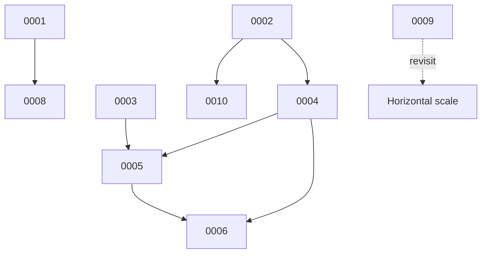

# Architecture Decision Records (ADR)

Reconstructed (retroactive) records of the significant decisions embodied in the codebase.
Format per ADR: **Status · Context · Options Considered · Decision · Rationale · Consequences ·
Risks · Future Evolution**.

## Registry

| ADR | Title | Status |
|-----|-------|--------|
| [0001](0001-monolith-serves-spa.md) | Monolith serves the SPA (single deployable) | Accepted |
| [0002](0002-postgresql-datastore.md) | PostgreSQL as the system of record | Accepted |
| [0003](0003-session-cookie-auth.md) | Session-cookie auth with OIDC/SAML/break-glass | Accepted |
| [0004](0004-app-settings-json-config.md) | Runtime config as JSON in `app_settings` | Accepted |
| [0005](0005-persona-capability-model.md) | Persona → capability authorization model | Accepted |
| [0006](0006-module-feature-flags.md) | Module on/off flags (404 on disabled) | Accepted |
| [0007](0007-derived-objective-status.md) | Objective RAG status is derived, not entered | Accepted |
| [0008](0008-server-side-report-rendering.md) | Server-side report/roadmap rendering (HTML + PPTX) | Accepted |
| [0009](0009-in-process-scheduler.md) | In-process background scheduler | Accepted (revisit at scale) |
| [0010](0010-alembic-migrations.md) | Alembic migrations as schema source of truth | Accepted |

## Dependency map

## Future ADR candidates
- Observability stack choice · Scheduler externalization · Multi-tenancy strategy · Frontend test
  stack · CD/environment promotion · Design-token system.
</content>
